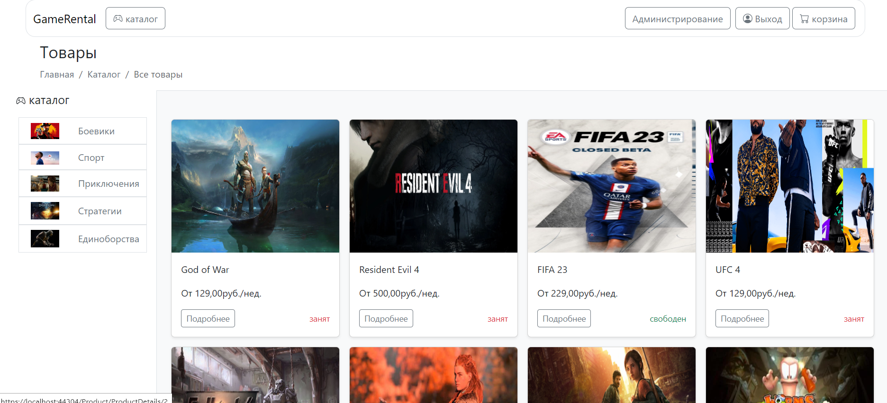
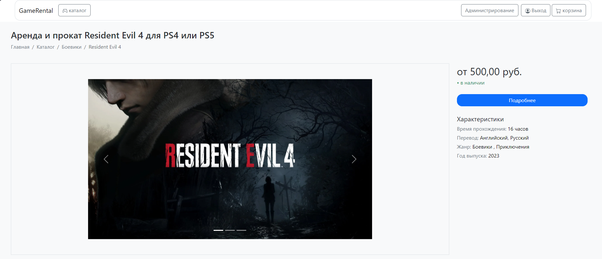
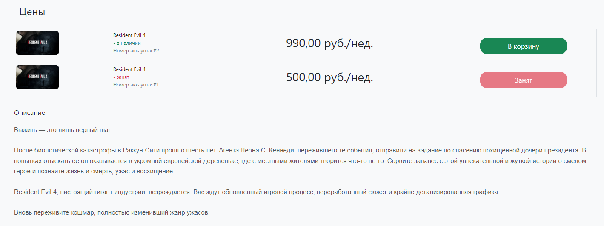
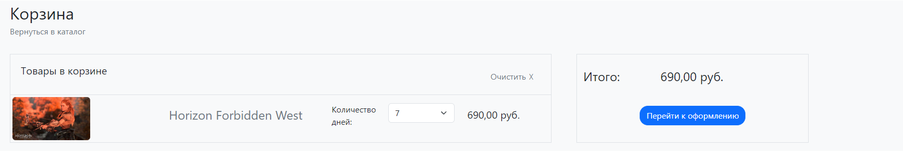
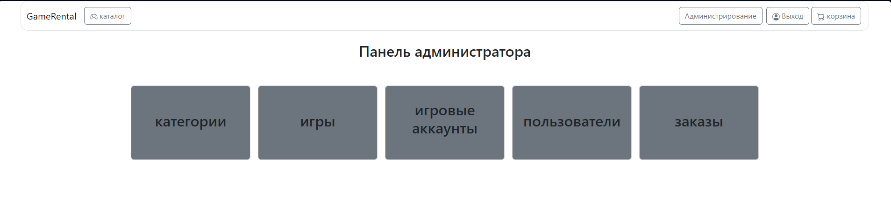
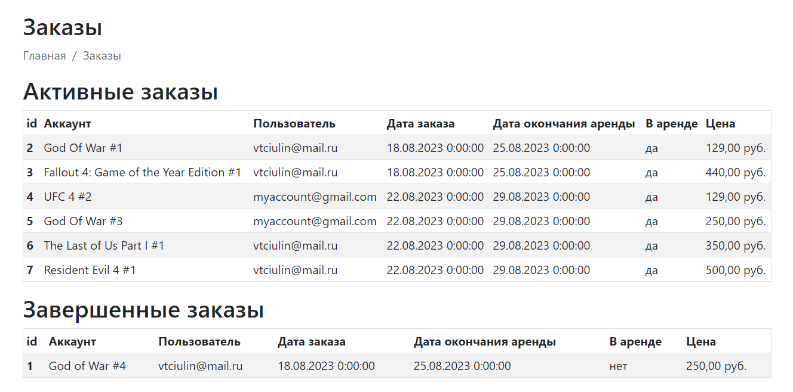
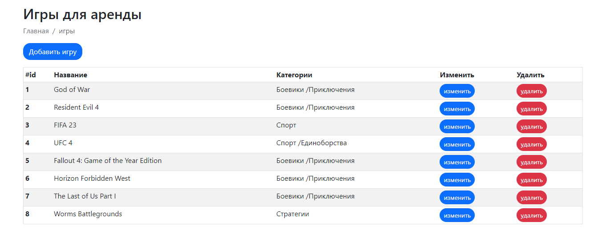
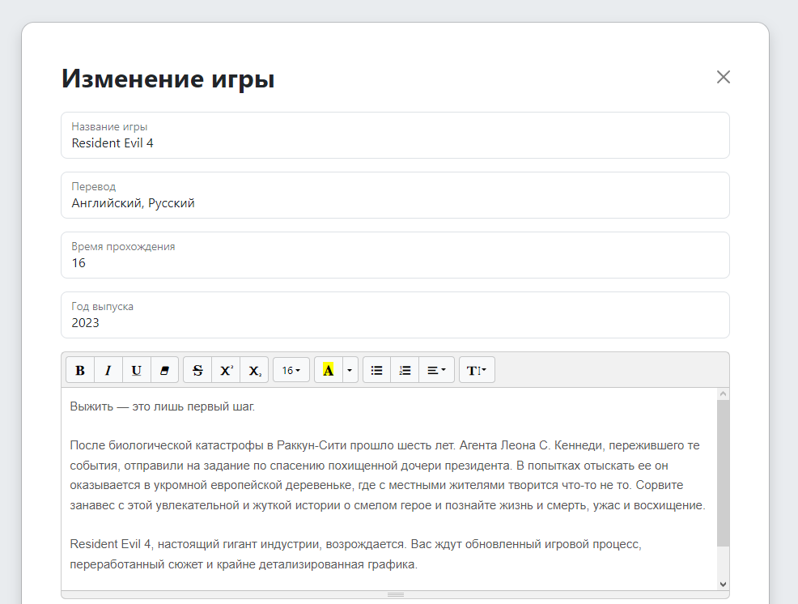
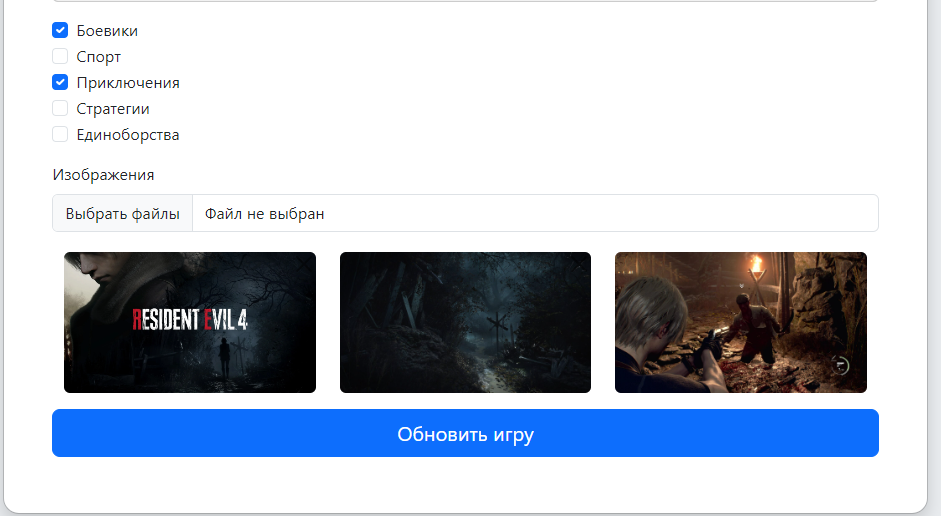
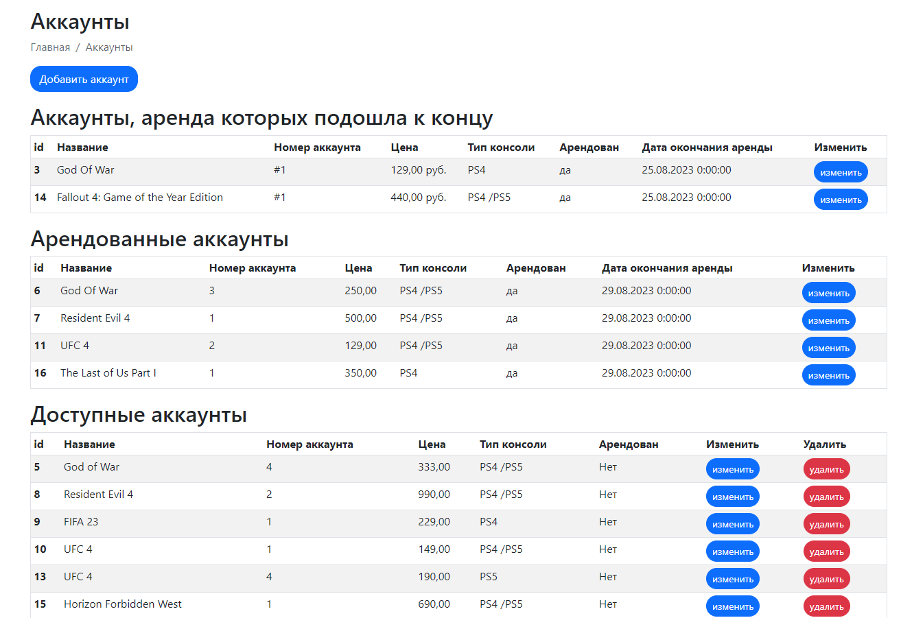

# GameRental 

## Описание

Данный проект представляет собой веб-платформу, которая позволяет арендовать игровые аккаунты для игровых приставок. С помощью этой платформы пользователи имеют возможность легко находить доступные аккаунты, выбирать игры, а также арендовать их на определенный период времени.

**Данный проект реализованн с использованием .NET 7 и базы данных MS SQL.**

## Технологии (Backend)

- .NET7
- ASP.Net Core MVC
- Entity Framework Core
- MSSQL
- ASP.Net Identity
- NUnit
- Moq
- AutoMapper
- FluentValidation

## Технологии (Frontend)

- Html/Css
- JS
- Bootstrap
- Summernote

## Архитектура

Данный проект использует луковую архитектуру и состоит из слоев:

 -  Domain. Данный слой содержит все сущности бд, а так же интерфейсы репозиториев.
 -  Application. Данный слой содержит логику приложения 
 -  Infrastructure. Слой, который содержит реализации репозиториев, сам контекст бд, а также почтовый сервис.
 -  Web. Слой, который использует логику из слоя application и отправляет данные веб-клиенту. 

## Запуск проекта

- Для запуска необходимо иметь .NET 7 SDK, MS SQL Server 
- Клонировать проект: https://github.com/Vova-Tciulin/GameRental.git
- собрать проект и запустить его 

## UI 
**Часть страниц веб-сайта**

 
Основная страница:

  
  
Страница товара:

  
  
 
Страница корзины:

 
 
Панель администратора:

 
 
Информация о заказах:

 
 
Информациях об играх:

 
 
Изменение игры:

 
 
 
Информация о доступных акканутах:

 

